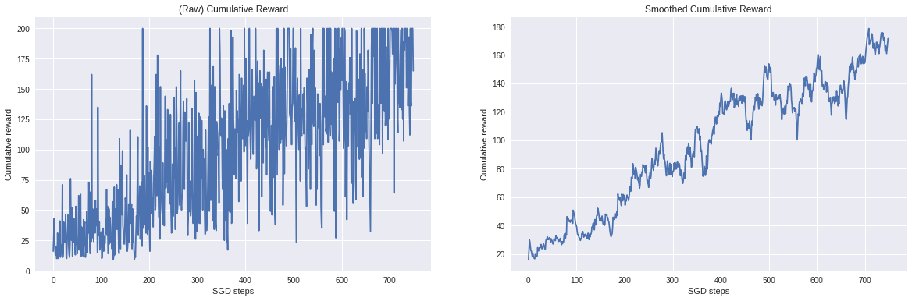
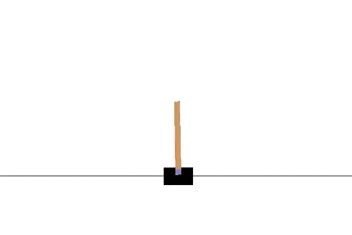

# Introduction to Policy Gradients with TensorFlow (Barcelona TensorFlow Meetup)

Resources for the introduction to Reinforcement Learning session at the Barcelona TensorFlow Meetup (October 4, 2018). They cover a quick introduction to RL, REINFORCE and code example to solve the CartPole task using [TensorFlow Eager](https://www.tensorflow.org/guide/eager).

## Resources

- [Slides](https://docs.google.com/presentation/d/1B13ifcYWZcDtvCShIrohQ2NJ1upeg-YyHAHHKBrPo10/edit?usp=sharing)
- [Code](https://colab.research.google.com/drive/1mmdZUuGFdH6cSv4WcH3RmL71HO14EXL8) is available in Google Colaboratory

## Results

After a while, the agent is able to keep the pole in balance during the whole episode (termination is forced after 200 steps):

